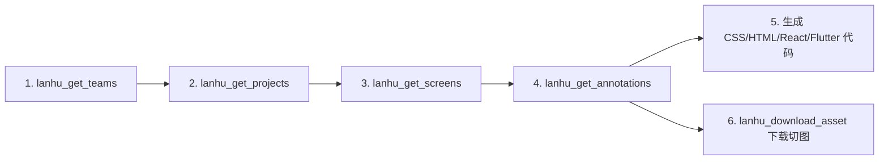

<div align="center">

# 蓝湖 MCP Server (Lanhu MCP)

**专为 [蓝湖 (Lanhu)](https://lanhuapp.com) 设计协作平台打造的 Model Context Protocol (MCP) 服务端。**

让 AI 编码助手（Claude、Cursor、Antigravity、Windsurf 等）能够直接读取蓝湖设计图的完整图层树、获取像素级精确的 CSS 标注样式，并自动下载切图图标——**全程无需消耗视觉 Vision Token**。

[简体中文](README.md) • [English](README_en.md)

<p align="center">
  <a href="https://github.com/xinayida/lanhu-mcp/releases"></a>
  <a href="https://www.python.org/downloads/"></a>
  <a href="https://modelcontextprotocol.io/"></a>
  <a href="https://github.com/astral-sh/uv"></a>
  <a href="LICENSE"></a>
</p>

</div>

---

## 💡 为什么需要 Lanhu MCP？

在日常使用 AI 辅助编写前端或移动端界面（React、Vue、Flutter、SwiftUI 等）时，通常依赖向大模型发送设计图截图。然而这种方式存在明显痛点：
- **Token 消耗巨大**：高清截图会严重消耗模型的 Vision 上下文窗口；
- **尺寸与颜色靠猜**：模型对间距、边距、圆角与色值的识别存在幻觉和偏差；
- **切图与图标无法自动化**：模型无法直接将设计稿中的 SVG 图标或图片切图导出到本地工程。

**Lanhu MCP Server** 通过逆向解析蓝湖 Web 端数据协议，直接为大模型提供结构化的设计标注树：

- ⚡ **零视觉 Token 消耗**：纯 JSON 结构化数据传输，极大节省上下文空间与响应延迟。
- 📐 **像素级绝对精确**：图层绝对坐标与尺寸（`x`, `y`, `width`, `height`）、精准色值（HEX/RGBA、设计规范色板名称 `color_name`）、线性与径向渐变（`gradient`）、字体排版（字号、粗细、行高、字距、复合文字分段 `spans`）、四角独立圆角（`border_radii`）、边框、阴影以及开箱即用的标准 `css` 样式字典全部精确提取。
- 🎨 **切图自动提取与 WebP 转换**：自动识别导出切图并提供直链下载，位图切图默认自动转为现代高效的 **WebP** 格式，矢量图标支持原生 **SVG** 导出，免去手动切图和臃肿的 PNG。
- 🔄 **会话全自动化管理**：内置基于 Playwright 的无头 Cookie 自动续期脚本，告别频繁手动登录。

---

## ✨ 核心特性

- **团队与项目浏览**：获取当前账号所在的团队列表、工作台设计项目，支持关键词搜索。
- **画板/设计图检索**：获取项目下的所有画板（Screen）信息、缩略图与尺寸信息。
- **深度图层标注解析**：递归解析完整图层树，还原组件嵌套层级，提供现成 CSS 属性、渐变色与多段文本样式。
- **资源直下通道**：一键下载设计图中的 SVG 矢量图与位图切图至本地指定目录，位图自动转为 WebP 格式。
- **持久化认证续期**：集成浏览器会话持久化与自动续期机制，稳定无感运行。

---

## 📋 环境要求

- **Python**：`>= 3.10`
- **包管理器**：推荐使用 [uv](https://docs.astral.sh/uv/)（快速且免配置）
- **MCP 客户端**：Cursor、Claude Desktop、Claude Code、Antigravity、Windsurf、Cline、Codex、VS Code 等支持 MCP 协议的工具。

---

## 🚀 快速上手

### 方式一：使用 `uvx` 一键运行（推荐，免克隆）

无需手动下载仓库，直接通过 `uvx` 即开即用：

```bash
uvx --from git+https://github.com/xinayida/lanhu-mcp.git lanhu-mcp
```

### 方式二：从源码克隆运行

```bash
# 克隆仓库
git clone https://github.com/xinayida/lanhu-mcp.git
cd lanhu-mcp

# 同步安装虚拟环境与依赖
uv sync

# 启动 MCP 服务端（stdio 模式）
uv run lanhu-mcp
```

---

## 🔐 认证配置

Lanhu MCP 通过 Cookie 访问 `lanhuapp.com`。Cookie 默认安全存储于 `~/.lanhu/cookie`（文件权限 `0600`）。

### 方式一：自动化登录与续期（最省心推荐）

运行项目内置的 Playwright 自动化续期脚本：

```bash
uv run scripts/refresh_cookie.py
```

- **已登录状态**：在后台以无头模式静默访问蓝湖，刷新 Session 并自动更新 `~/.lanhu/cookie`。
- **登录态过期**：自动唤起 Chrome 窗口，等待用户进行一次登录（短信验证码或密码），登录成功后自动保存 Cookie 并关闭浏览器。

> **定时任务提示**：可通过 `--headless-only` 参数配置到系统的 Cron 定时任务中定期静默刷新：
> ```bash
> uv run scripts/refresh_cookie.py --headless-only
> ```

### 方式二：在对话中通过工具动态设置

在 AI 对话中直接调用 MCP 工具传入 Cookie：

```python
lanhu_set_cookie(cookie="session=...; user_token=...")
```

*手动获取 Cookie 方法*：
1. 在浏览器登录 [lanhuapp.com](https://lanhuapp.com)，按 `F12` 打开开发者工具。
2. 切换至 **Network (网络)** 面板，点击任意发往 `lanhuapp.com` 的请求。
3. 在 **Request Headers (请求标头)** 中复制包含 `session` 和 `user_token` 的完整 `Cookie` 内容。

### 方式三：通过环境变量配置

在项目根目录创建 `.env` 文件或配置环境变量 `LANHU_COOKIE`：

```bash
cp .env.example .env
# 编辑 .env 文件，填写 LANHU_COOKIE=session=...; user_token=...
```

---

## 🛠️ MCP 客户端配置指南

选择您常用的 AI 编辑器/客户端进行一键接入：

<details open>
<summary><b>Cursor</b></summary>

打开 **Cursor Settings** -> **MCP** -> **Add new MCP Server**：
- **Name**: `lanhu`
- **Type**: `command`
- **Command**:
  ```bash
  uvx --from git+https://github.com/xinayida/lanhu-mcp.git lanhu-mcp
  ```

或直接编辑配置文件 `~/.cursor/mcp.json`：

```json
{
  "mcpServers": {
    "lanhu": {
      "command": "uvx",
      "args": ["--from", "git+https://github.com/xinayida/lanhu-mcp.git", "lanhu-mcp"]
    }
  }
}
```

</details>

<details>
<summary><b>Claude Desktop</b></summary>

编辑 `claude_desktop_config.json`（macOS 路径：`~/Library/Application Support/Claude/claude_desktop_config.json`）：

```json
{
  "mcpServers": {
    "lanhu": {
      "command": "uvx",
      "args": ["--from", "git+https://github.com/xinayida/lanhu-mcp.git", "lanhu-mcp"]
    }
  }
}
```

</details>

<details>
<summary><b>Claude Code</b></summary>

使用 Claude Code 命令行直接添加：

```bash
claude mcp add lanhu uvx --from git+https://github.com/xinayida/lanhu-mcp.git lanhu-mcp
```

</details>

<details>
<summary><b>Antigravity / Gemini CLI</b></summary>

在 Antigravity 插件配置或 `settings.json` 中添加：

```json
{
  "mcpServers": {
    "lanhu": {
      "command": "uvx",
      "args": ["--from", "git+https://github.com/xinayida/lanhu-mcp.git", "lanhu-mcp"]
    }
  }
}
```

</details>

<details>
<summary><b>Windsurf</b></summary>

在 `~/.codeium/windsurf/mcp_config.json` 中添加：

```json
{
  "mcpServers": {
    "lanhu": {
      "command": "uvx",
      "args": ["--from", "git+https://github.com/xinayida/lanhu-mcp.git", "lanhu-mcp"]
    }
  }
}
```

</details>

<details>
<summary><b>Cline / Roo Code</b></summary>

在 `cline_mcp_settings.json` 中配置：

```json
{
  "mcpServers": {
    "lanhu": {
      "command": "uvx",
      "args": ["--from", "git+https://github.com/xinayida/lanhu-mcp.git", "lanhu-mcp"],
      "disabled": false,
      "autoApprove": []
    }
  }
}
```

</details>

<details>
<summary><b>Codex</b></summary>

使用 Codex CLI 命令添加：

```bash
codex mcp add lanhu uvx "--from" "git+https://github.com/xinayida/lanhu-mcp.git" "lanhu-mcp"
```

或在 `~/.codex/config.toml` 中配置：

```toml
[mcp_servers.lanhu]
command = "uvx"
args = ["--from", "git+https://github.com/xinayida/lanhu-mcp.git", "lanhu-mcp"]
```

</details>

<details>
<summary><b>VS Code / Copilot</b></summary>

在 VS Code 设置或 `.vscode/mcp.json` 中添加：

```json
{
  "mcpServers": {
    "lanhu": {
      "command": "uvx",
      "args": ["--from", "git+https://github.com/xinayida/lanhu-mcp.git", "lanhu-mcp"]
    }
  }
}
```

</details>

---

## 🧰 工具清单与参数

| 工具名称 | 功能描述 | 核心参数 |
|:---|:---|:---|
| `lanhu_set_cookie` | 设置认证 Cookie 并持久化保存到 `~/.lanhu/cookie` | `cookie`: 包含 `session` 和 `user_token` 的 Cookie 字符串 |
| `lanhu_get_teams` | 获取当前用户的团队列表（兼具认证连通性检测） | *(无)* |
| `lanhu_get_projects` | 获取指定团队下的所有设计项目 | `team_id`: 团队 ID |
| `lanhu_search_projects` | 按名称关键词搜索团队内的项目 | `team_id`: 团队 ID, `keyword`: 搜索关键词 |
| `lanhu_get_screens` | 获取指定项目下的画板列表（含尺寸和缩略图） | `project_id`: 项目 ID, `team_id`: 团队 ID |
| `lanhu_search_images` | 按名称关键词搜索画板/设计图 | `project_id`: 项目 ID, `team_id`: 团队 ID, `keyword`: 搜索关键词 |
| `lanhu_get_annotations` | **⭐ 核心工具**：获取单张设计图的完整图层树与 CSS 标注数据 | `project_id`: 项目 ID, `image_id`: 设计图 ID, `team_id`: 团队 ID |
| `lanhu_get_assets` | 获取画板中所有可导出的切图/图标直链资源列表 | `project_id`: 项目 ID, `image_id`: 设计图 ID, `team_id`: 团队 ID |
| `lanhu_download_asset` | 下载切图到本地磁盘（位图自动转 WebP，矢量图保存为 SVG） | `asset_id`, `asset_name`, `download_url`, `format`, `save_dir` |

---

## 🧭 典型 AI 编程工作流

当您向 AI 助手提出需求：

```text
用户：“请帮我还原蓝湖项目里的收银台支付页面，并自动下载页面所需的图标资源。”
```

AI 助手将自主按如下链路协同执行：



### 代码调用示例

```python
# 1. 验证认证并获取团队
teams = lanhu_get_teams()
team_id = teams[0]["id"]

# 2. 获取项目列表
projects = lanhu_get_projects(team_id=team_id)
project_id = projects[0]["id"]

# 3. 获取画板列表
screens = lanhu_get_screens(project_id=project_id, team_id=team_id)
image_id = screens[0]["id"]

# 4. 获取核心图层标注与样式数据
annotations = lanhu_get_annotations(
    project_id=project_id,
    image_id=image_id,
    team_id=team_id
)

# 5. 下载页面切图/图标（位图默认保存为 webp，矢量图保存为 svg）
assets = lanhu_get_assets(project_id=project_id, image_id=image_id, team_id=team_id)
lanhu_download_asset(
    asset_id=assets[0]["id"],
    asset_name=assets[0]["name"],
    download_url=assets[0]["download_url"],
    format="webp" # 亦可指定 "svg"
)
```

---

## 📦 标注数据结构示例

调用 `lanhu_get_annotations` 返回的完整结构化 JSON：

```json
{
  "id": "651234567890abcdef",
  "name": "收银台",
  "width": 375.0,
  "height": 812.0,
  "thumbnail_url": "https://...",
  "layers": [
    {
      "id": "layer_01",
      "name": "提交按钮",
      "type": "rect",
      "bounds": { "x": 16.0, "y": 740.0, "width": 343.0, "height": 48.0 },
      "border_radius": 12.0,
      "opacity": 1.0,
      "visible": true,
      "fills": [
        {
          "type": "gradient",
          "gradient": {
            "type": "linear",
            "angle": 180.0,
            "css": "linear-gradient(180deg, rgba(69,140,255,1) 0%, rgba(40,40,55,1) 100%)",
            "stops": [
              { "position": 0.0, "color": "#458CFF", "color_rgba": "rgba(69,140,255,1)" },
              { "position": 1.0, "color": "#282837", "color_rgba": "rgba(40,40,55,1)" }
            ]
          }
        }
      ],
      "borders": [
        {
          "width": 1.0,
          "style": "solid",
          "position": "center",
          "color": "#00C18C",
          "color_rgba": "rgba(0,193,140,1)",
          "color_name": "Brand/Primary",
          "css": "1.0px solid rgba(0,193,140,1)"
        }
      ],
      "css": {
        "width": "343px",
        "height": "48px",
        "background": "linear-gradient(180deg, rgba(69,140,255,1) 0%, rgba(40,40,55,1) 100%)",
        "border": "1.0px solid rgba(0,193,140,1)",
        "border-radius": "12px"
      },
      "children": [
        {
          "id": "layer_02",
          "name": "PriceText",
          "type": "text",
          "text": "7.2km",
          "bounds": { "x": 130.0, "y": 754.0, "width": 61.0, "height": 40.0 },
          "font": {
            "size": 32.0,
            "weight": "700",
            "family": "DINAlternate-Bold",
            "line_height": 40.0,
            "color": "#E9E6F8",
            "color_rgba": "rgba(233,230,248,1)",
            "spans": [
              { "text": "7.2", "size": 32.0, "weight": "700", "family": "DINAlternate-Bold", "color": "#E9E6F8" },
              { "text": "km", "size": 16.0, "weight": "700", "family": "DINAlternate-Bold", "color": "#E9E6F8" }
            ]
          },
          "css": {
            "width": "61px",
            "height": "40px",
            "font-family": "DINAlternate-Bold",
            "font-size": "32px",
            "font-weight": "700",
            "line-height": "40px",
            "color": "#E9E6F8"
          }
        }
      ]
    }
  ],
  "assets": [
    {
      "id": "asset_01:svg",
      "name": "icon_alipay",
      "format": "svg",
      "download_url": "https://..."
    },
    {
      "id": "asset_02:webp",
      "name": "banner_bg",
      "format": "webp",
      "download_url": "https://..."
    }
  ]
}
```

---

## ⚙️ 环境变量配置说明

| 环境变量 | 默认值 | 说明 |
|:---|:---|:---|
| `LANHU_COOKIE` | *(空)* | 蓝湖 Cookie 兜底配置（格式 `session=...; user_token=...`） |
| `LANHU_DOWNLOAD_DIR` | `~/Downloads/lanhu_assets` | 切图资源下载保存的目标目录 |
| `LANHU_TIMEOUT` | `30` | API 网络请求超时时间（秒） |
| `LANHU_LOG_LEVEL` | `INFO` | 日志输出级别（`DEBUG`, `INFO`, `WARNING`, `ERROR`） |

---

## ⚠️ 免责声明

本项目仅供个人学习、技术研究与 AI 辅助开发效率探索之目的，通过逆向分析 Web 接口实现。请在使用过程中严格遵守蓝湖服务条款。因使用本开源工具产生的任何风险与责任由使用者自行承担。

---

## 📄 开源许可

本项目基于 [MIT License](LICENSE) 协议开源。
