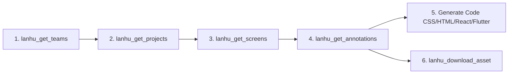

<div align="center">

# Lanhu MCP Server

**A Model Context Protocol (MCP) server for [Lanhu (蓝湖)](https://lanhuapp.com) design collaboration platform.**

Enable LLMs and AI coding assistants to directly inspect design artboards, extract pixel-perfect CSS properties and layer hierarchies, and download exportable assets—with **zero vision token overhead**.

[English](README.md) • [简体中文](README_zh.md)

<p align="center">
  <a href="https://github.com/xinayida/lanhu-mcp/releases"></a>
  <a href="https://www.python.org/downloads/"></a>
  <a href="https://modelcontextprotocol.io/"></a>
  <a href="https://github.com/astral-sh/uv"></a>
  <a href="LICENSE"></a>
</p>

</div>

---

## 💡 Why Lanhu MCP?

When implementing UI designs with AI coding agents (Claude, Cursor, Copilot, Antigravity, etc.), passing screenshots often results in:
- High token cost for vision models
- Imprecise positioning, guessed margins, and approximate colors
- Hallucinated font sizes and line heights
- Inability to automatically extract and download SVG/image assets

**Lanhu MCP Server** parses Lanhu's structured design specs directly into typed data trees:

- ⚡ **Zero Vision Token Overhead**: Pure JSON structured data instead of heavy screenshots.
- 📐 **Pixel-Perfect Accuracy**: Exact layer bounds (`x`, `y`, `width`, `height`), colors (HEX/RGBA), typography (`fontSize`, `fontWeight`, `fontFamily`, `lineHeight`), border radius, fills, borders, and shadows.
- 🎨 **Smart Asset Extraction**: Automatically discovers slice assets, provides direct CDN download links, and supports lossless conversion to modern **WebP** or **SVG** formats.
- 🔄 **Resilient Authentication**: Persistent session management with automated headless token refresh via Playwright.

---

## ✨ Key Features

- **Team & Project Exploration**: Query teams, workspace design files, and search projects seamlessly.
- **Artboard Inspection**: List artboards (`screens`), preview thumbnails, and search screens by name.
- **Deep Layer Annotations**: Recursively retrieve complete layer trees with comprehensive CSS/UI styling attributes.
- **Asset Pipeline**: Download SVG vectors and bitmap images directly to your local workspace.
- **Automated Session Keeper**: Headless Playwright script keeps your Lanhu session alive in the background without repeated manual logins.

---

## 📋 Requirements

- **Python**: `>= 3.10`
- **Package Manager**: [uv](https://docs.astral.sh/uv/) (strongly recommended)
- **MCP Client**: Cursor, Claude Desktop, Claude Code, Antigravity, Windsurf, Cline, Codex, VS Code, or any other MCP-compatible tool.

---

## 🚀 Quick Start

### 1. Run with `uvx` (No installation needed)

You can run `lanhu-mcp` directly without cloning the repository:

```bash
uvx --from git+https://github.com/xinayida/lanhu-mcp.git lanhu-mcp
```

### 2. Run from Source

```bash
# Clone the repository
git clone https://github.com/xinayida/lanhu-mcp.git
cd lanhu-mcp

# Sync environment and dependencies
uv sync

# Run the server (stdio mode)
uv run lanhu-mcp
```

---

## 🔐 Authentication

Lanhu MCP connects to `lanhuapp.com` using browser session cookies. It reads from `~/.lanhu/cookie` (file permission `0600`).

### Method 1: Automated Login & Refresh (Recommended)

Run the included Playwright automation script:

```bash
uv run scripts/refresh_cookie.py
```

- **If already logged in**: Headlessly verifies session, refreshes token, and writes to `~/.lanhu/cookie`.
- **If session expired**: Automatically opens a Chrome window for a one-time login (SMS code or password). Once authenticated, it saves the session and closes the browser.

> **Tip for Scheduled Tasks**: Run with `--headless-only` in cron jobs to periodically renew the cookie without popping up windows:
> ```bash
> uv run scripts/refresh_cookie.py --headless-only
> ```

### Method 2: Dynamic Set via Chat Tool

Call the MCP tool directly inside your AI chat:

```python
lanhu_set_cookie(cookie="session=...; user_token=...")
```

*To get your cookie manually*:
1. Open [lanhuapp.com](https://lanhuapp.com) in Chrome and open DevTools (`F12`).
2. Go to **Network** tab, click any request to `lanhuapp.com`.
3. In **Request Headers**, copy the full `Cookie` string containing `session` and `user_token`.

### Method 3: Environment Variable

Create `.env` in the project root or pass `LANHU_COOKIE`:

```bash
cp .env.example .env
# Edit .env and set LANHU_COOKIE=session=...; user_token=...
```

---

## 🛠️ MCP Client Configuration

Add `lanhu-mcp` to your favorite MCP client:

<details open>
<summary><b>Cursor</b></summary>

Go to **Cursor Settings** -> **MCP** -> **Add new MCP Server**:
- **Name**: `lanhu`
- **Type**: `command`
- **Command**:
  ```bash
  uvx --from git+https://github.com/xinayida/lanhu-mcp.git lanhu-mcp
  ```

Or configure via `~/.cursor/mcp.json`:

```json
{
  "mcpServers": {
    "lanhu": {
      "command": "uvx",
      "args": ["--from", "git+https://github.com/xinayida/lanhu-mcp.git", "lanhu-mcp"]
    }
  }
}
```

</details>

<details>
<summary><b>Claude Desktop</b></summary>

Add to your `claude_desktop_config.json` (macOS: `~/Library/Application Support/Claude/claude_desktop_config.json`):

```json
{
  "mcpServers": {
    "lanhu": {
      "command": "uvx",
      "args": ["--from", "git+https://github.com/xinayida/lanhu-mcp.git", "lanhu-mcp"]
    }
  }
}
```

</details>

<details>
<summary><b>Claude Code</b></summary>

Use the Claude Code CLI:

```bash
claude mcp add lanhu uvx --from git+https://github.com/xinayida/lanhu-mcp.git lanhu-mcp
```

</details>

<details>
<summary><b>Antigravity / Gemini CLI</b></summary>

Add to your Antigravity configuration or `settings.json`:

```json
{
  "mcpServers": {
    "lanhu": {
      "command": "uvx",
      "args": ["--from", "git+https://github.com/xinayida/lanhu-mcp.git", "lanhu-mcp"]
    }
  }
}
```

</details>

<details>
<summary><b>Windsurf</b></summary>

Add to `~/.codeium/windsurf/mcp_config.json`:

```json
{
  "mcpServers": {
    "lanhu": {
      "command": "uvx",
      "args": ["--from", "git+https://github.com/xinayida/lanhu-mcp.git", "lanhu-mcp"]
    }
  }
}
```

</details>

<details>
<summary><b>Cline / Roo Code</b></summary>

Add to your `cline_mcp_settings.json`:

```json
{
  "mcpServers": {
    "lanhu": {
      "command": "uvx",
      "args": ["--from", "git+https://github.com/xinayida/lanhu-mcp.git", "lanhu-mcp"],
      "disabled": false,
      "autoApprove": []
    }
  }
}
```

</details>

<details>
<summary><b>Codex</b></summary>

Add using the Codex CLI:

```bash
codex mcp add lanhu uvx "--from" "git+https://github.com/xinayida/lanhu-mcp.git" "lanhu-mcp"
```

Or edit `~/.codex/config.toml`:

```toml
[mcp_servers.lanhu]
command = "uvx"
args = ["--from", "git+https://github.com/xinayida/lanhu-mcp.git", "lanhu-mcp"]
```

</details>

<details>
<summary><b>VS Code / Copilot</b></summary>

Add via VS Code MCP extension or settings:

```json
{
  "mcpServers": {
    "lanhu": {
      "command": "uvx",
      "args": ["--from", "git+https://github.com/xinayida/lanhu-mcp.git", "lanhu-mcp"]
    }
  }
}
```

</details>

---

## 🧰 Available Tools

| Tool Name | Description | Key Parameters |
|:---|:---|:---|
| `lanhu_set_cookie` | Update authentication cookie and persist to `~/.lanhu/cookie` | `cookie`: string containing `session` and `user_token` |
| `lanhu_get_teams` | Retrieve user teams list (also acts as auth health check) | *(none)* |
| `lanhu_get_projects` | Fetch design projects in a specific team | `team_id`: string |
| `lanhu_search_projects` | Search projects in team by keyword | `team_id`: string, `keyword`: string |
| `lanhu_get_screens` | List all artboards/screens under a project with dimensions & thumbnails | `project_id`: string, `team_id`: string |
| `lanhu_search_images` | Search artboards by keyword | `project_id`: string, `team_id`: string, `keyword`: string |
| `lanhu_get_annotations` | **⭐ Core Tool**: Retrieve complete layer tree, CSS styles, typography & assets | `project_id`: string, `image_id`: string, `team_id`: string |
| `lanhu_get_assets` | Get exportable image/icon assets with download URLs | `project_id`: string, `image_id`: string, `team_id`: string |
| `lanhu_download_asset` | Download asset to local disk (supports WebP lossless / SVG / PNG) | `asset_id`, `asset_name`, `download_url`, `format`, `save_dir` |

---

## 🧭 Typical AI Pair-Programming Workflow

When asking your AI agent to implement a UI from Lanhu:

```text
User: "Please implement the checkout screen from our Lanhu project and download necessary icons."
```

The agent will autonomously execute the following chain:



### Example Tool Invocation

```python
# 1. Fetch team list
teams = lanhu_get_teams()
team_id = teams[0]["id"]

# 2. Get project list
projects = lanhu_get_projects(team_id=team_id)
project_id = projects[0]["id"]

# 3. Get artboards list
screens = lanhu_get_screens(project_id=project_id, team_id=team_id)
image_id = screens[0]["id"]

# 4. Extract full annotations
annotations = lanhu_get_annotations(
    project_id=project_id,
    image_id=image_id,
    team_id=team_id
)

# 5. Download icons/slices
assets = lanhu_get_assets(project_id=project_id, image_id=image_id, team_id=team_id)
lanhu_download_asset(
    asset_id=assets[0]["id"],
    asset_name=assets[0]["name"],
    download_url=assets[0]["download_url"],
    format="webp" # or "svg"
)
```

---

## 📦 Annotation Data Structure

Calling `lanhu_get_annotations` returns structured JSON:

```json
{
  "id": "651234567890abcdef",
  "name": "Checkout Page",
  "width": 375.0,
  "height": 812.0,
  "thumbnail_url": "https://...",
  "layers": [
    {
      "id": "layer_01",
      "name": "Submit Button",
      "type": "rect",
      "bounds": { "x": 16.0, "y": 740.0, "width": 343.0, "height": 48.0 },
      "border_radius": 8.0,
      "opacity": 1.0,
      "visible": true,
      "fills": [
        { "type": "color", "color": "#0066FF", "opacity": 1.0 }
      ],
      "shadows": [
        { "x": 0.0, "y": 4.0, "blur": 12.0, "spread": 0.0, "color": "#0066FF33" }
      ],
      "children": [
        {
          "id": "layer_02",
          "name": "Button Label",
          "type": "text",
          "text": "Confirm & Pay",
          "bounds": { "x": 140.0, "y": 754.0, "width": 95.0, "height": 20.0 },
          "font": {
            "size": 16.0,
            "weight": "600",
            "family": "PingFang SC",
            "line_height": 20.0,
            "letter_spacing": 0.0,
            "color": "#FFFFFF",
            "text_align": "center"
          }
        }
      ]
    }
  ],
  "assets": [
    {
      "id": "asset_01:svg",
      "name": "icon_cart",
      "format": "svg",
      "download_url": "https://..."
    }
  ]
}
```

---

## ⚙️ Environment Variables

| Variable | Default | Description |
|:---|:---|:---|
| `LANHU_COOKIE` | *(empty)* | Raw cookie string fallback (`session=...; user_token=...`) |
| `LANHU_DOWNLOAD_DIR` | `~/Downloads/lanhu_assets` | Directory where downloaded assets are stored |
| `LANHU_TIMEOUT` | `30` | API HTTP request timeout in seconds |
| `LANHU_LOG_LEVEL` | `INFO` | Logging level (`DEBUG`, `INFO`, `WARNING`, `ERROR`) |

---

## ⚠️ Disclaimer

This project is an independent open-source tool developed for educational, testing, and AI productivity research purposes. It interacts with Lanhu through reverse-engineered web interfaces. Please adhere to Lanhu's Terms of Service when using this tool. The authors are not responsible for any misuse.

---

## 📄 License

This project is licensed under the [MIT License](LICENSE).
