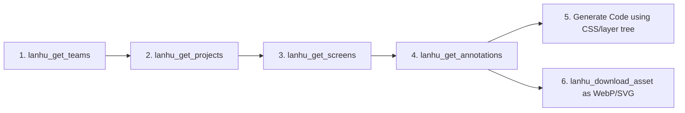

<div align="center">

# Lanhu MCP Server

**A Model Context Protocol (MCP) server for [Lanhu (蓝湖)](https://lanhuapp.com) design collaboration platform.**

Enable LLMs and AI coding assistants to directly inspect design artboards, extract pixel-perfect CSS properties and layer hierarchies, and download exportable assets—with **zero vision token overhead**.

[English](README_en.md) • [简体中文](README.md)

<p align="center">
  <a href="https://github.com/xinayida/lanhu-mcp/releases"></a>
  <a href="https://www.python.org/downloads/"></a>
  <a href="https://modelcontextprotocol.io/"></a>
  <a href="https://github.com/astral-sh/uv"></a>
  <a href="LICENSE"></a>
</p>

</div>

---

## 💡 Why Lanhu MCP?

When implementing UI designs with AI coding agents (Claude, Cursor, Copilot, Antigravity, etc.), passing screenshots often results in:
- High token cost for vision models
- Imprecise positioning, guessed margins, and approximate colors
- Hallucinated font sizes and line heights
- Inability to automatically extract and download SVG/image assets

**Lanhu MCP Server** parses Lanhu's structured design specs directly into typed data trees:

- ⚡ **Zero Vision Token Overhead**: Pure JSON structured data instead of heavy screenshots.
- 📐 **Pixel-Perfect Accuracy**: Exact layer bounds (`x`, `y`, `width`, `height`), colors (HEX, RGBA, opacity, design system token names), typography (`fontSize`, `fontWeight`, `fontFamily`, `lineHeight`, `letterSpacing`, rich text `spans`), independent corner radii, fills (including gradients with calculated angles), borders, and shadows.
- 🎯 **Ready-to-Use CSS Output**: Every layer includes a calculated, standard `css` dictionary ready to paste or translate into Tailwind, CSS, Compose, or SwiftUI.
- 🎨 **Automated WebP Asset Pipeline**: Discovers slice assets and downloads SVG vectors directly, while automatically converting all raster/bitmap images into high-quality modern **WebP** files.
- 🔄 **Resilient Authentication**: Persistent session management with automated headless token refresh via Playwright.

---

## ✨ Key Features

- **Team & Project Exploration**: Query teams, workspace design files, and search projects seamlessly.
- **Artboard Inspection**: List artboards (`screens`), preview thumbnails, and search screens by name.
- **Deep Layer Annotations**: Recursively retrieve complete layer trees with comprehensive CSS/UI styling attributes, rich text spans, and gradient specifications.
- **Asset Pipeline (WebP & SVG)**: Download SVG vector icons and convert bitmap assets to WebP directly into your project workspace.
- **Automated Session Keeper**: Headless Playwright script keeps your Lanhu session alive in the background without repeated manual logins.

---

## 📋 Requirements

- **Python**: `>= 3.10`
- **Package Manager**: [uv](https://docs.astral.sh/uv/) (strongly recommended)
- **MCP Client**: Cursor, Claude Desktop, Claude Code, Antigravity, Windsurf, Cline, Codex, VS Code, or any other MCP-compatible tool.

---

## 🚀 Quick Start

### Option 1: Run with `uvx` (Recommended, no clone required)

Run directly using `uvx`:

```bash
uvx --from git+https://github.com/xinayida/lanhu-mcp.git lanhu-mcp
```

### Option 2: Clone & Run from Source

```bash
# Clone the repository
git clone https://github.com/xinayida/lanhu-mcp.git
cd lanhu-mcp

# Install dependencies and sync virtual environment
uv sync

# Run MCP server (stdio mode)
uv run lanhu-mcp
```

---

## 🔐 Authentication Setup

Lanhu MCP connects to `lanhuapp.com` using session cookies stored securely in `~/.lanhu/cookie` (file permissions `0600`).

### Method 1: Automated Login & Refresh (Recommended)

Run the built-in Playwright script:

```bash
uv run scripts/refresh_cookie.py
```

- **Active Session**: Quietly refreshes your session in headless mode and updates `~/.lanhu/cookie`.
- **Expired Session**: Automatically opens a Chrome window for a quick one-time login (SMS or password), then saves the session and closes the browser.

> **Cron Tip**: You can add this to your system cron for periodic silent maintenance using `--headless-only`:
> ```bash
> uv run scripts/refresh_cookie.py --headless-only
> ```

### Method 2: Set Cookie Dynamically via Tool Call

Call the MCP tool directly in your AI chat:

```python
lanhu_set_cookie(cookie="session=...; user_token=...")
```

*How to copy cookie manually*:
1. Log into [lanhuapp.com](https://lanhuapp.com) in your browser and press `F12` to open DevTools.
2. Go to the **Network** tab and click any request to `lanhuapp.com`.
3. In **Request Headers**, copy the full `Cookie` string containing `session` and `user_token`.

### Method 3: Environment Variable

Create a `.env` file or export `LANHU_COOKIE`:

```bash
cp .env.example .env
# Edit .env and set LANHU_COOKIE=session=...; user_token=...
```

---

## 🛠️ MCP Client Configuration

<details open>
<summary><b>Cursor</b></summary>

Go to **Cursor Settings** -> **MCP** -> **Add new MCP Server**:
- **Name**: `lanhu`
- **Type**: `command`
- **Command**:
  ```bash
  uvx --from git+https://github.com/xinayida/lanhu-mcp.git lanhu-mcp
  ```

Or edit `~/.cursor/mcp.json`:

```json
{
  "mcpServers": {
    "lanhu": {
      "command": "uvx",
      "args": ["--from", "git+https://github.com/xinayida/lanhu-mcp.git", "lanhu-mcp"]
    }
  }
}
```

</details>

<details>
<summary><b>Claude Desktop</b></summary>

Edit `claude_desktop_config.json` (`~/Library/Application Support/Claude/claude_desktop_config.json` on macOS):

```json
{
  "mcpServers": {
    "lanhu": {
      "command": "uvx",
      "args": ["--from", "git+https://github.com/xinayida/lanhu-mcp.git", "lanhu-mcp"]
    }
  }
}
```

</details>

<details>
<summary><b>Claude Code</b></summary>

Run the CLI command:

```bash
claude mcp add lanhu uvx --from git+https://github.com/xinayida/lanhu-mcp.git lanhu-mcp
```

</details>

<details>
<summary><b>Antigravity / Gemini CLI</b></summary>

Add to your `settings.json`:

```json
{
  "mcpServers": {
    "lanhu": {
      "command": "uvx",
      "args": ["--from", "git+https://github.com/xinayida/lanhu-mcp.git", "lanhu-mcp"]
    }
  }
}
```

</details>

<details>
<summary><b>Windsurf</b></summary>

Add to `~/.codeium/windsurf/mcp_config.json`:

```json
{
  "mcpServers": {
    "lanhu": {
      "command": "uvx",
      "args": ["--from", "git+https://github.com/xinayida/lanhu-mcp.git", "lanhu-mcp"]
    }
  }
}
```

</details>

<details>
<summary><b>Cline / Roo Code</b></summary>

Configure in `cline_mcp_settings.json`:

```json
{
  "mcpServers": {
    "lanhu": {
      "command": "uvx",
      "args": ["--from", "git+https://github.com/xinayida/lanhu-mcp.git", "lanhu-mcp"],
      "disabled": false,
      "autoApprove": []
    }
  }
}
```

</details>

<details>
<summary><b>Codex</b></summary>

Run via Codex CLI:

```bash
codex mcp add lanhu uvx "--from" "git+https://github.com/xinayida/lanhu-mcp.git" "lanhu-mcp"
```

</details>

<details>
<summary><b>VS Code / Copilot</b></summary>

Add to `.vscode/mcp.json`:

```json
{
  "mcpServers": {
    "lanhu": {
      "command": "uvx",
      "args": ["--from", "git+https://github.com/xinayida/lanhu-mcp.git", "lanhu-mcp"]
    }
  }
}
```

</details>

---

## 🧰 Available Tools

| Tool Name | Description | Key Parameters |
|:---|:---|:---|
| `lanhu_set_cookie` | Set authentication cookie and persist to `~/.lanhu/cookie` | `cookie`: Cookie string with `session` and `user_token` |
| `lanhu_get_teams` | Retrieve user teams and verify connection | *(None)* |
| `lanhu_get_projects` | List design projects under a team | `team_id`: Team ID |
| `lanhu_search_projects` | Search projects in a team by keyword | `team_id`: Team ID, `keyword`: Search keyword |
| `lanhu_get_screens` | List artboards/screens in a project (with dimensions & thumbnail) | `project_id`: Project ID, `team_id`: Team ID |
| `lanhu_search_images` | Search artboards/screens by name keyword | `project_id`: Project ID, `team_id`: Team ID, `keyword`: Search keyword |
| `lanhu_get_annotations` | **⭐ Core Tool**: Retrieve deep layer tree, typography, colors, CSS, and slice links | `project_id`: Project ID, `image_id`: Screen ID, `team_id`: Team ID |
| `lanhu_get_assets` | List exportable slice assets (SVG for vectors, WebP for bitmaps) | `project_id`: Project ID, `image_id`: Screen ID, `team_id`: Team ID |
| `lanhu_download_asset` | Download slices locally (bitmaps auto-converted to WebP, vectors saved as SVG) | `asset_id`, `asset_name`, `download_url`, `format`, `save_dir` |

---

## 🧭 Typical AI Workflow

When you ask an AI coding assistant:

```text
User: "Please implement the Checkout page from the Lanhu project, and download all required icons."
```

The AI assistant will execute the following pipeline:



### Python API Example

```python
# 1. Validate auth & get teams
teams = await client.get_teams()
team_id = teams[0].id

# 2. Get projects
projects = await client.get_projects(team_id=team_id)
project_id = projects[0].id

# 3. Get artboards
screens = await client.get_screens(project_id=project_id, team_id=team_id)
image_id = screens[0].id

# 4. Get full annotations with CSS & colors
annotations = await client.get_annotations(
    project_id=project_id,
    image_id=image_id,
    team_id=team_id
)

# 5. Download slices (bitmaps saved as WebP, vectors as SVG)
assets = await client.get_assets(project_id=project_id, image_id=image_id, team_id=team_id)
await client.download_asset(assets[0])
```

---

## 📦 Annotation Data Structure Example

```json
{
  "id": "651234567890abcdef",
  "name": "Checkout",
  "width": 375.0,
  "height": 812.0,
  "thumbnail_url": "https://...",
  "layers": [
    {
      "id": "layer_01",
      "name": "SubmitButton",
      "type": "rect",
      "bounds": { "x": 16.0, "y": 740.0, "width": 343.0, "height": 48.0 },
      "border_radius": 12.0,
      "opacity": 1.0,
      "visible": true,
      "fills": [
        {
          "type": "gradient",
          "gradient": {
            "type": "linear",
            "angle": 180.0,
            "css": "linear-gradient(180deg, rgba(69,140,255,1) 0%, rgba(40,40,55,1) 100%)",
            "stops": [
              { "position": 0.0, "color": "#458CFF", "color_rgba": "rgba(69,140,255,1)" },
              { "position": 1.0, "color": "#282837", "color_rgba": "rgba(40,40,55,1)" }
            ]
          }
        }
      ],
      "borders": [
        {
          "width": 1.0,
          "style": "solid",
          "position": "center",
          "color": "#00C18C",
          "color_rgba": "rgba(0,193,140,1)",
          "color_name": "Brand/Primary",
          "css": "1.0px solid rgba(0,193,140,1)"
        }
      ],
      "css": {
        "width": "343px",
        "height": "48px",
        "background": "linear-gradient(180deg, rgba(69,140,255,1) 0%, rgba(40,40,55,1) 100%)",
        "border": "1.0px solid rgba(0,193,140,1)",
        "border-radius": "12px"
      },
      "children": [
        {
          "id": "layer_02",
          "name": "PriceText",
          "type": "text",
          "text": "7.2km",
          "bounds": { "x": 130.0, "y": 754.0, "width": 61.0, "height": 40.0 },
          "font": {
            "size": 32.0,
            "weight": "700",
            "family": "DINAlternate-Bold",
            "line_height": 40.0,
            "color": "#E9E6F8",
            "color_rgba": "rgba(233,230,248,1)",
            "spans": [
              { "text": "7.2", "size": 32.0, "weight": "700", "family": "DINAlternate-Bold", "color": "#E9E6F8" },
              { "text": "km", "size": 16.0, "weight": "700", "family": "DINAlternate-Bold", "color": "#E9E6F8" }
            ]
          },
          "css": {
            "width": "61px",
            "height": "40px",
            "font-family": "DINAlternate-Bold",
            "font-size": "32px",
            "font-weight": "700",
            "line-height": "40px",
            "color": "#E9E6F8"
          }
        }
      ]
    }
  ],
  "assets": [
    {
      "id": "asset_01:svg",
      "name": "icon_alipay",
      "format": "svg",
      "download_url": "https://..."
    },
    {
      "id": "asset_02:webp",
      "name": "banner_bg",
      "format": "webp",
      "download_url": "https://..."
    }
  ]
}
```

---

## ⚙️ Environment Variables

| Variable | Default | Description |
|:---|:---|:---|
| `LANHU_COOKIE` | *(None)* | Lanhu cookie configuration (`session=...; user_token=...`) |
| `LANHU_DOWNLOAD_DIR` | `~/Downloads/lanhu_assets` | Target directory for asset downloads |
| `LANHU_TIMEOUT` | `30` | Network request timeout (seconds) |
| `LANHU_LOG_LEVEL` | `INFO` | Logging level (`DEBUG`, `INFO`, `WARNING`, `ERROR`) |

---

## ⚠️ Disclaimer

This project is for personal learning, technical research, and AI-assisted development productivity exploration. It connects through Lanhu's private web APIs. Please comply with Lanhu's terms of service. The authors assume no liability for misuse.

---

## 📄 License

This project is licensed under the [MIT License](LICENSE).
